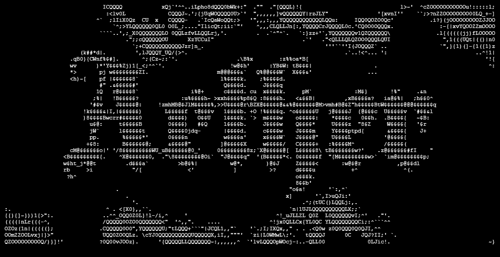

# AETHER

AETHER is a C2 framework designed for red team engagements and educational purposes.

## Components

AETHER is composed of three primary modules. Each of them is capable of running independently, but designed to work in unison.

### [GHOST](https://github.com/ENIX1701/GHOST)

Modular C++ implant deployable to Linux hosts. It features toggleable capabilities mapped to the [MITRE ATT&CK](https://attack.mitre.org/) framework.

### [SHADOW](https://github.com/ENIX1701/SHADOW)

Heart of AETHER. C2 server written in Rust. It exposes a RESTful API to handle agent communication, tasking and aggregation. It also features endpoints useful for creating user interfaces. Speaking of those...

### [CHARON](https://github.com/ENIX1701/CHARON)

Terminal user interface written in Rust. Completes SHADOW and gives unfathomable power to any operator who takes its call. Enables agent status visualization, payload crafting and remote command execution.

## Prerequisites

`Docker` with `Compose` plugin. That's basically it.

## Run

AETHER is designed to be deployed instantly using Docker Compose. It deploys SHADOW and CHARON. They use a private container network, how cool is that?

```bash
git clone --recurse-submodules https://github.com/ENIX1701/AETHER

# build and deploy the images
docker compose up --build -d
```

Access CHARON with:
```bash
docker attach charon
```

### Sandbox

If you don't want to go through the hassle of building and deploying your own GHOSTs, but still want to feel the thrill of being a C2 operator, here's what I've done for you:
```bash
# this spawns SHADOW + CHARON and 3 GHOSTs :3 
docker compose --profile sandbox up --scale ghost=3

# optionally you can also specify tested impact level
# you do that by passing GHOST_IMPACT_LEVEL before the command, like:
GHOST_IMPACT_LEVEL=SYSTEM docker compose --profile sandbox up --scale ghost=3

# you can specify scenarios in the same way
GHOST_SCENARIO_MODE=APT29 docker compose --profile sandbox up --scale ghost=3

# and even do both at the same time!
GHOST_IMPACT_LEVEL=SYSTEM GHOST_SCENARIO_MODE=APT29 docker compose --profile sandbox up --scale ghost=3
```

These synthetic GHOSTs work as you'd expect them to. Which is exactly as they would in real-world deploy. Check it out for yourself!

## Roadmap (v2.0)

### Future

- [ ] Unified logging in each module
- [ ] Persistent storage for SHADOW and CHARON
- [ ] GHOST architecture refactor for 

## Legal

> [!IMPORTANT]
> This software is for educational purposes and authorized red team engagements only. The authors are not responsible for misuse.

---

Special thanks to [awesome-readme](https://github.com/matiassingers/awesome-readme) for README ideas and to [readme.so](https://readme.so/) for helping me make this one coherent at all :3
